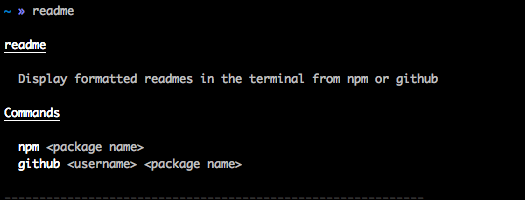
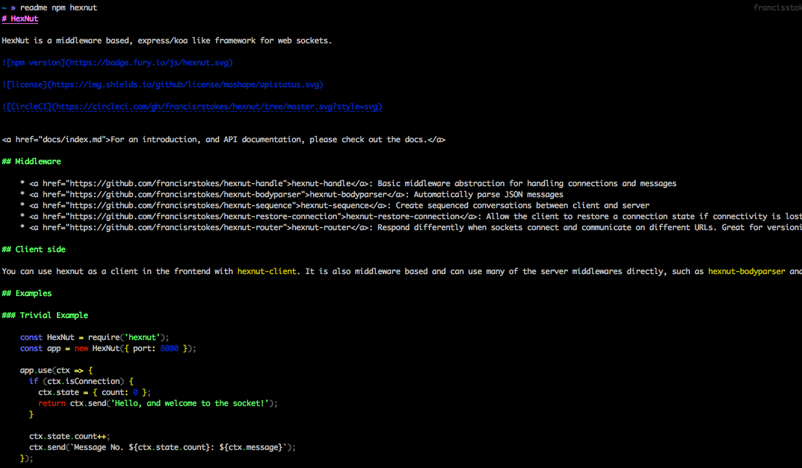
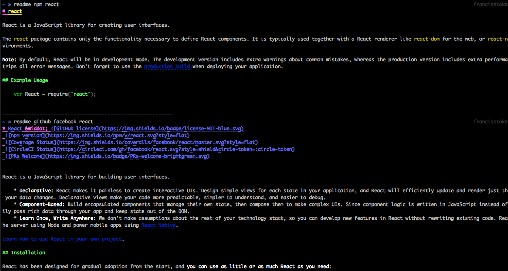

# readme-cli

`readme-cli` is a terminal README renderer that can fetch information from either github or npm.

## Installation

TDB

## Usage



### NPM

```bash
readme npm hexnut-sequence
```



### Github

```bash
readme github francisrstokes 16bitjs
```


